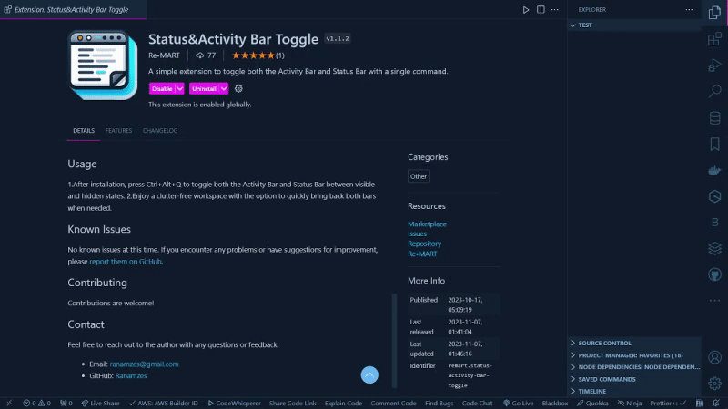

# Status&Activity Bar Toggle


<!-- version -->
**Version:** 1.1.2
<!-- versionend -->

**Author:** Re•MART

**[GitHub Repository](https://github.com/Ranamzes/status-activity-bar-toggle-vscode)**

A simple Visual Studio Code extension that allows you to toggle both the Activity Bar and Status Bar with a single command.


## Features

- Toggle the Activity Bar and Status Bar visibility simultaneously.
- Customizable keyboard shortcut (Ctrl+Alt+Q) for quick toggling.

## Installation

You can install this extension directly from the Visual Studio Code Marketplace.

1. Launch Visual Studio Code.
2. Go to the Extensions view by clicking on the square icon in the sidebar.
3. Search for "Status&Activity Bar Toggle."
4. Click the Install button.

Alternatively, you can install it from the command line:

```bash
code --install-extension remart.status-activity-bar-toggle
```

## Usage

1.After installation, press Ctrl+Alt+Q to toggle both the Activity Bar and Status Bar between visible and hidden states.
2.Enjoy a clutter-free workspace with the option to quickly bring back both bars when needed.

## Known Issues

No known issues at this time. If you encounter any problems or have suggestions for improvement, please [report them on GitHub](https://github.com/Ranamzes/status-activity-bar-toggle-vscode/issues).

## Contributing

Contributions are welcome!

## Contact

Feel free to reach out to the author with any questions or feedback:

- Email: ranamzes@gmail.com
- GitHub: [Ranamzes](https://github.com/Ranamzes)
